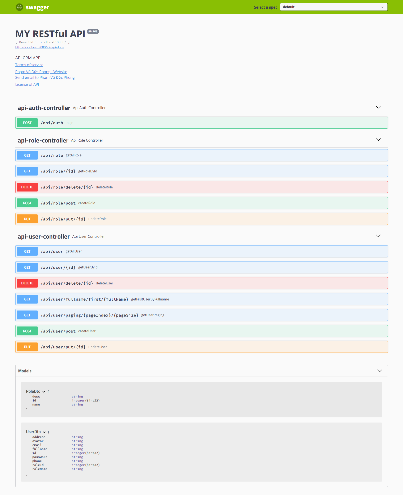

# Spring Boot Demo
## Table of Contents
* [Technologies Used](#technologies-used)
* [Setup](#setup)
* [Screenshots](#screenshots)
* [Contact](#contact)

## Technologies Used
- Eclipse 2022
- JavaSE-11
- Springboot
- Spring Security
- MySQL
- Thymeleaf
- RESTful API
- JPA
- Hibernate

## Setup
- MySQL : run file `./db/crm.sql` to create database
- Run server on `http://localhost:8080/` and and first login use email (`admin@gmail.com`) and password (`1`) to login with ROLE_ADMIN

## Screenshots

## Contact
Created by [@phongpham](https://www.linkedin.com/in/phongphamdev/) - feel free to contact me!
